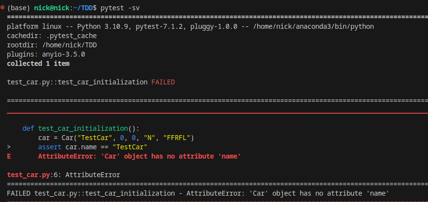
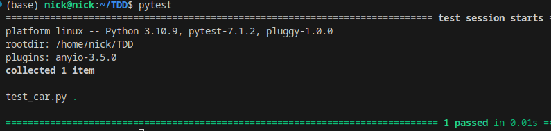
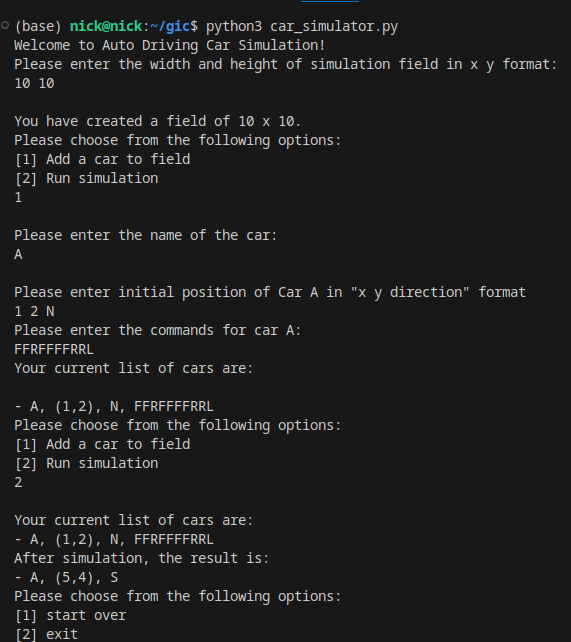
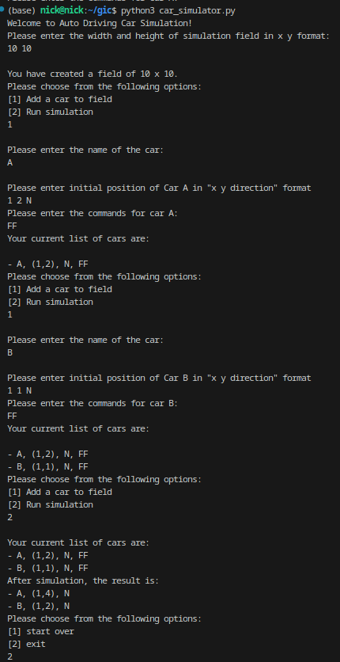
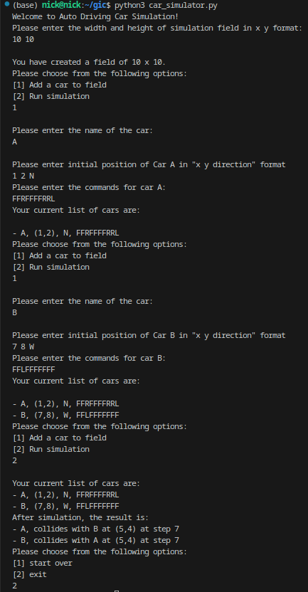
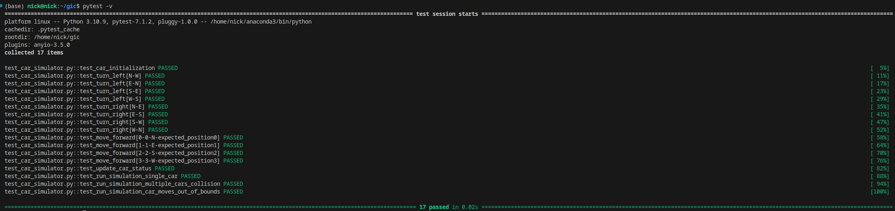

# Auto Driving Car Simulation

## Overview

The Auto Driving Car Simulation is a Python-based project designed to simulate the movements of multiple cars on a grid. Each car can move forward, turn left, or turn right based on a series of commands. The simulation checks for collisions between cars and ensures that cars do not move outside the designated grid boundaries.

## Design Considerations

### Data Types and Structures

#### Car Class

- **Purpose**: Represents each car in the simulation.
- **Attributes**:
  - **name** (string): Uniquely identifies each car. It represents name of the car.
  - **x, y** (integers): Represent the car's current position or co-ordinate on the grid.
  - **direction** (string): Indicates the car's current facing direction (N, E, S, W).
  - **commands** (string): A sequence of commands ('F', 'L', 'R') that the car will execute. 
  - **status** (string or None): Used to store information about collisions or if the car goes out of bounds. At the initial stage it is set to None to indicate No issue.

#### Functions and Their Decisions

- **turn_left, turn_right**: Determines the new direction after a turn. It uses a list (`allowed_directions`) and use indexes to map directions efficiently. I am taking clock-wise direction approach here
- **move_forward**: Calculates the new position based on the current direction. Returns a tuple `(new_x, new_y)`, as tuples are immutable and provide a good way to group the new position coordinates together.
- **update_car_status**: Updates a car's status in case of a collision or going out of bounds. 
- **run_simulation**: Orchestrates the simulation, handling command execution, collision detection, and boundary checks.
  - Uses dictionaries (`positions` and `step_positions`) to track car positions for  lookup and collision detection. Keys are tuples for coordinates, and values are car names.

### Development Approach - TDD
The entire development of code is done in TDD approach means Red-Green-Refactor method.
#### Example 
**Car Class**

`Car Class initialization`

```python
class Car:
    def __init__(self, name, x, y, direction, commands):     
        pass
```

`Test case`

```python
import pytest
from car_simulator import Car
def test_car_initialization():
    car = Car("TestCar", 0, 0, "N", "FFRFL")
    assert car.name == "TestCar"
    assert car.x == 0
    assert car.y == 0
    assert car.direction == "N"
    assert car.commands == "FFRFL"
    assert str(car) == "- TestCar, (0,0), N"
```
`Running Test case Now`



`Refactor Car Class`
``` python
class Car:
    def __init__(self, name, x, y, direction, commands):     
        self.name = name
        self.x = x
        self.y = y
        self.direction = direction
        self.commands = commands
        self.status = None
    def __str__(self):
        
        if self.status:
            return self.status
        return f"- {self.name}, ({self.x},{self.y}), {self.direction}"
```
Now add `from car_simulator import Car` in the test file and execute `pytest` again



Similarly I wrote the 6 test cases and refactored the code to pass the test cases.

### Execution Steps

1. **Environment Setup**: Ensure you have Python 3 (Code is develeoped and tested in 3.10).
2. **Running the Simulation**:
    - Clone the repository
    - Navigate to the cloned directory containing `car_simulator.py`.
    - Run the script by executing `python3 car_simulator.py`.
3. **Using the Simulation**:
    - Enter the width and height of the simulation field when prompted.
    - Add cars by providing their name, initial position, direction, and commands.
    - Choose to run the simulation. The final statuses of all cars will be displayed, including their final positions or any collisions at specific step or boundary issues.
#### Execution Scenarios
**Scenario 1: Single Car Simulation**




**Scenario 2: Multicar Simultaion**



**Scenario 3: Car Collission**



### Test cases

#### Used `pytest` for writing test cases
There are 6 test cases written to test the functionality of `car_simulator.py`.
1. Testing the `Car` Class Initialization and String Representation and returning the output in specific format
2. Testing Direction Changes (turn_left)
3. Testing Direction Changes (turn_right)
4. Testing Movement (move_forward)
5. Testing Collision and Status Update
6. Testing the Simulation Logic

**Running Test cases**

Just go to the terminal and type `pytest -sv`



## Further Enhancement to make it product fit

1. Providing a reverse command or Back command (B). It increases realism factor
2. Instead of facing N,E,W,S only, we can also allow to Car to face diagonal as in NE, NW, SE, SW. This could also allow to reach the destination faster.
3. We can introduce the collision avoidance factor, which basically allows car to stop to collide with each other or with any other object in its way
4. We can add GUI to visualise it much better